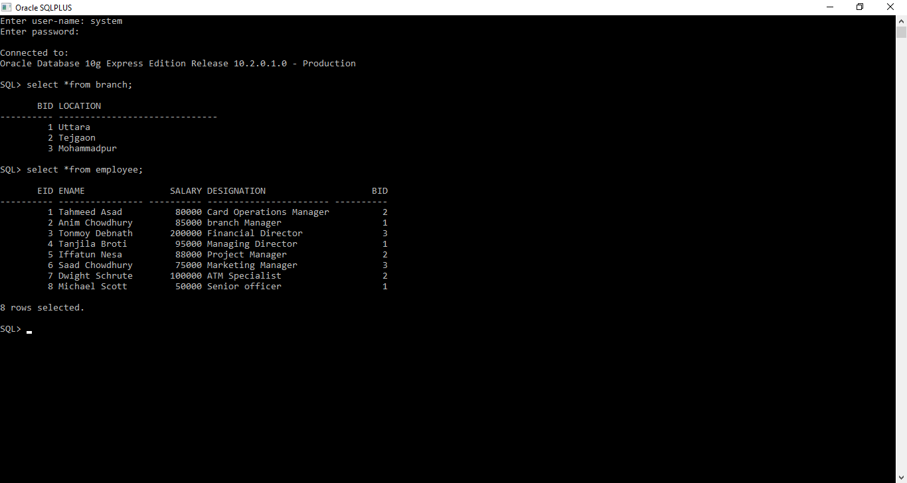
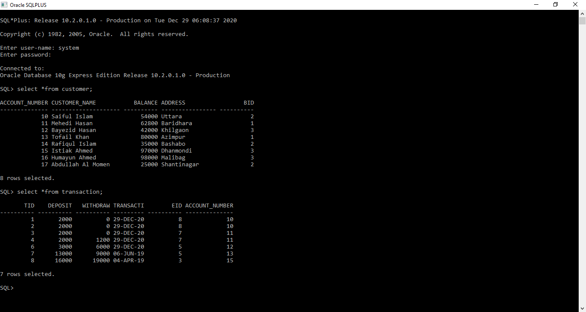
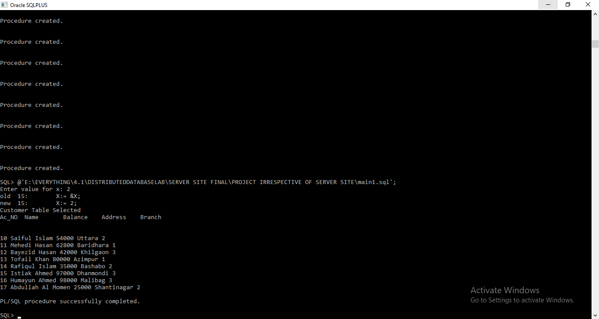

# Bank-Management-System-Using-Distributed-Database

## Table of contents

* [Introduction](#introduction)

* [Features](#features)

* [Technologies](#technologies)

* [Relational Schema](#relational-schema)

* [Demo Screenshots](#demo-screenshots)

* [Setup](#setup)

## Introduction

This is a distributed database designed to maintain the day-to-day operation of a bank having different branches. This group project was built for an undergraduate academic course.

## Features

* The admin can insert new employees in the bank
* An employee can register new customers in the bank
* The admin can update the information of an employee
* The admin can delete the information of an employee from the database
* The admin can select/see all the details of an employee by using each attribute of the ‘Employee’ table as a criterion
* The admin/authorized employee can select/see all the details of a customer by using each attribute of the ‘Customer’ table as a criterion
* The admin/authorized employee can select/see all the details of a transaction by using each attribute of the ‘Transaction’ table as a criterion
* The admin/an employee can select/see all the entries of the ‘branch’ table
* An authorized employee can update the information on the ‘Customer’ table (Only address)
* An authorized employee can delete the information of a customer
* Authorized employees can handle transaction-deposition of money, withdrawal of money of a customer. The transaction details can also be seen. Also, the balance of that    customer will be updated accordingly
* The admin/authorized employee can see all customer details of a certain branch
* The admin/authorized employee can see all employee details of a certain branch
* The admin/authorized employee can see all transaction details that occurred at a certain branch
* The admin/authorized employee can see the list of employees who were involved in the transaction of a certain customer
* The admin/authorized employee can see all the customer details whose transactions were handled by a certain employee
* The admin/authorized employee can see all the employee details who handled transactions during a certain period of time
* The admin/authorized employee can see all the customer details who transacted during a certain period of time
* The admin/authorized employee can see all the transaction details that occurred during a certain range/period of time
* The admin/authorized employee can see the total number of transactions that occurred at a certain branch
* The admin/authorized employee can see the total number of customers who registered at a certain branch
* The admin/authorized employee can see the total number of employees who work at a certain branch

## Technologies

* Oracle Database
* PL/SQL

## Relational Schema

Branch (BID: integer, location: string).  
Employee (EID: integer, Ename: string, salary: integer, designation: string, BID: integer).  
Customer (Account_number: integer, Customer_name: string, balance: integer, address: string, BID: integer).  
Transaction (TID: integer, deposit: integer, withdraw: integer, transaction_date: string, EID: integer, Account_number: integer).  

  
  ## Demo Screenshots
  

 
 
  <h3>   </h3>

 

 

 
 
 
 
  <h3>   </h3>

 

 

 
 
 
 
 
  <h3>   </h3>

 

 

 
 ## Setup
 
It is better to use Microsoft Visual Studio IDE (Integrated Development Environment) to run this project properly. The 'JOBPORTAL.sln' file should be opened with the IDE to  built the project and to run it.
